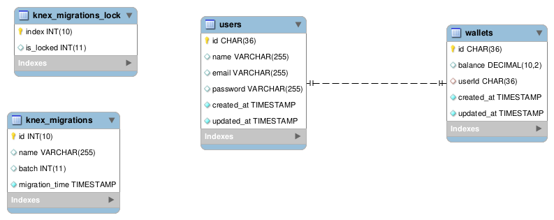

# Project Title

---

Demo Credit Official Backend API repository

Demo Credit is a mobile lending app that requires wallet functionality. This is needed as borrowers need a wallet to receive the loans they have been granted and also send the money for repayments.

## Prerequisite

1. Make sure you have `node` install (version >=14)

## Getting started

1. Clone the repository into your computer
2. Open the cloned repo with a code editor of choice (vscode recommended)
3. From the code editor, open a terminal window (for vs code use <CTRL+SHIFT+`> without the '< >' )
4. Run `npm install` to install all dependencies used in this project
5. Start a dev server using `npm run dev`
6. If everything went well, you should see the following printed on the terminal console
   [Server is running on port: 5000]

---

## Install

    $ git clone https://github.com/rauchips/demo_credit_rauchips
    $ cd demo_credit_rauchips

## Configure app

create a `.env` file then edit it with your settings. You will need:

- HOST=
- DB=
- PASSWORD=
- JWT=
- NODE_ENV=

## Running the project for development

    $ npm run dev

## Simple build for production

    $ npm start

## Running the project for testing

    $ npm test

## ERD DIAGRAM

